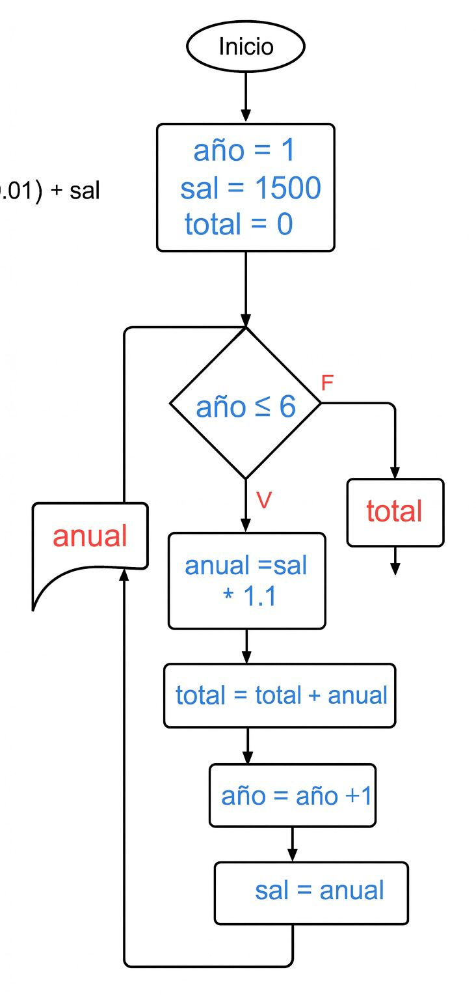
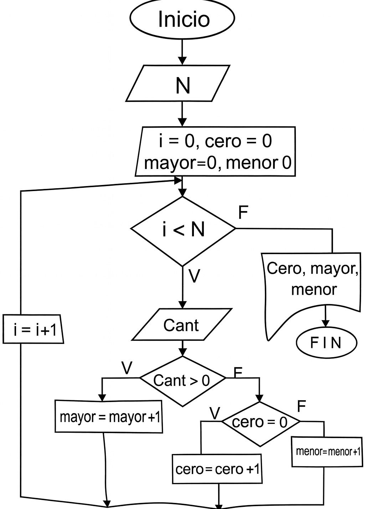

# Bucles 
## ejercicio 1
Un profesor tiene un salario inicial de $1500, y recibe un incremento de 10 % anual durante 6 años. ¿Cuál es su salario al cabo de 6 
años? ¿Qué salario ha recibido en cada uno de los 6 años? Realice el algoritmo y represente la solución mediante el diagrama de flujo, el pseudocódigo 

## pseudocodigo

```
inicio 
año = 1 
sal = 1500
total = 0 
mientras año <= 6 
     anual =sal * 1.1
     total = total + anual 
     sal = anual 
     mostrar anual 
fin mientras 
mostrar total 
fin 

 ```



## ejercicio 2 

se requiere un algoritmo para determinar, de N cantidades, cuántas son cero, cuántas son menores a cero, y cuántas son mayores a cero. Realice el diagrama de flujo, el pseudocódigo 

input 
N, cant 
output 
cero, mayor, menor (contador)
control
i 

## pseudocodigo

 ```

inicio
leer n 
i ← 0
cero ← 0
mayor ← 0
menor ← 0

    mientras i < N 
        leer Cant
        si Cant > 0 entonces
            mayor = mayor + 1
        sino
            si Cant = 0 ENTONCES
                cero = cero + 1
            sino
                menor = menor + 1
            fin si
        fin si
        i = i + 1
    fin mientras

mostrar "cero:", cero
mostrar "mayor:", mayor
mostrar "menor:", menor
fin

 ```



## ejercicio 3

Tienen una tarjeta de $10.000.000. Calcular el valor de todas las cuotas sabiendo:
Valor de la compra
Tasa de interés del 2%
Número de cuotas. Máximo 36. 

input 
valorcompra, numCuotas
output 
cuota, totalPagar, interesTotal
control
i 

 ```
 
inicio
    saldoTarjeta = 10000000

    leer valorCompra
    leer numCuotas

    si numCuotas > 36 entonces
        mostrar "Error: máximo 36 cuotas"
        fin
    fin si
    si valorCompra > saldoTarjeta entonces
        IMPRIMIR "Error: el valor de la compra no puede exceder $10.000.000."
        fin
    fin si 

    tasa ← 0.02
    totalPagar = valorCompra * (1 + tasa * numCuotas)
    valorCuota = totalPagar / numCuotas

mostrar "Valor de la compra:", valorCompra
mostrar "Número de cuotas:", numCuotas
mostrar "Tasa de interés:", tasa * 100, "%"
mostrar "Total a pagar:", totalPagar
mostrar "Valor de cada cuota:", valorCuota
fin

 ```
 ok 