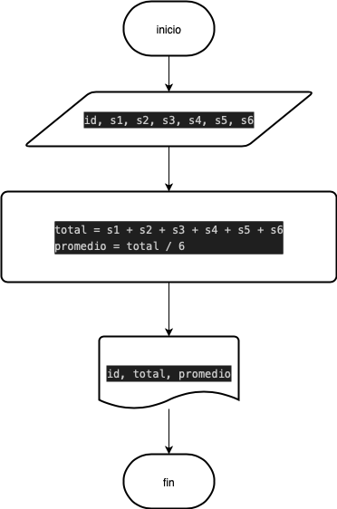
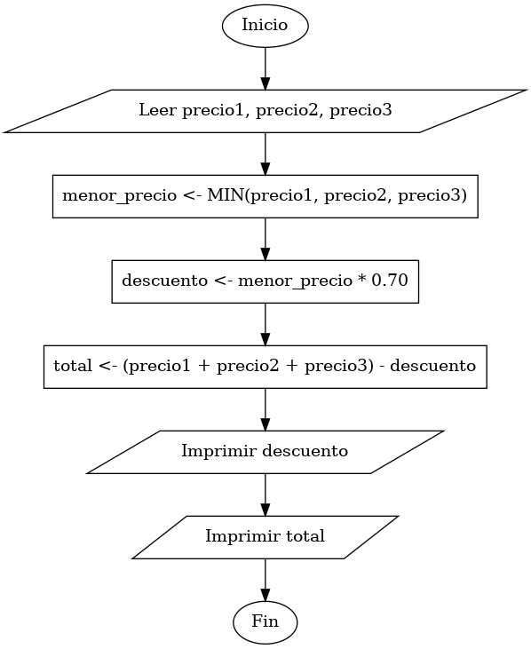

# ejercicio 2. 

Construye un algoritmo que, al recibir como datos el ID del empleado y los seis primeros sueldos del año, calcule el ingreso total semestral y el promedio mensual, e imprima el ID del empleado, el ingreso total y el promedio mensual.

## Psudocódigo 

```
inicio 
leer id, s1, s2, s3, s4, s5, s6
total = s1 + s2 + s3 + s4 + s5 + s6
promedio = total / 6 
mostrar id, total, promedio 
fin
```
## Diagrama de flujo



# Ejercicio 3 

Una empresa importadora desea determinar cuantos dolares puede adquirir con equis cantidad de dinero colombiano. Realice un diagrama de flujo y pseudocodigo que representen el algoritmo para tal fin. 

## Psudocódigo 

```

inicio
leer pesos_colombianos, tasa_dolar
dolares = pesos_colombianos / tasa_dolar
mostrar dolares
fin

```
## Diagrama de flujo


# Ejercicio 3
Realice un algoritmo para determinar cuánto se debe pagar por equis cantidad de lápices considerando que si son 1000 o más el costo es de $85 cada uno; de lo contrario, el precio es de $90. Represéntelo con el pseudocódigo y el diagrama de flujo.

| Variables de entrada | Descripcion |
|----------------------|-------------|
|cant_lapices | cuantos lapices compran |

| Variables de salida | Descripocion |
|---------------------|--------------|
| precio | Valor que hay que pagar |

| Variables de intermedios| Descripocion |
|-------------------------|--------------|
| Valor_unitario | Valor que hay que pagar |


| Constantes | Descripocion |
|------------|--------------|
| 1000 | Cantidad limite de lapices |
|$85, $90 | Valor individual segun la cantidad |

## Pseudocidigo

```
inicio
leer cant_lapices 
si cant_lapices >=100
    valor_unidad = 85
si no 
    valor_unidad = 90
fin si 
precio = valor unidad * cant_lapices 
mostrar  "valor total: ", precio
fin

```


# Ejercico 4 
Un almacén de ropa tiene una promoción: por compras superiores a $250 000 se les aplicará un descuento de 15%, de caso contrario, sólo se aplicará un 8% de descuento. Realice un algoritmo para determinar el precio final que debe pagar una persona por comprar en dicho almacén y de cuánto es el descuento que obtendrá. Represéntelo mediante el pseudocódigo y el diagrama de flujo.

| Variables de entrada | Descripcion |
|----------------------|-------------|
|valor_compra | costo parcial de las compras |

| Variables de salida | Descripocion |
|---------------------|--------------|
| precio_final | Valor que hay que pagar |

| Constantes | Descripocion |
|------------|--------------|
| 250000 | valor a apartir del cual se da el descuento |
|15%, 8% | Descuentos|

## Pseudocodigo

```
Inicio
Leer valor_compra
Si valor_compra > 250000
   descuento - valor _compra * 0.15
si no
   descuento = valor_compra * 0.08
Fin Si
precio_final - valor_compra - descuento
Mostrar "Valor a pagar: 5", precio_final
fin 
```
# Ejercico 5 

El director de una escuela está organizando un viaje de estudios, y requiere determinar cuánto debe cobrar a cada alumno y cuánto debe pagar a la compañía de viajes por el servicio. La forma de cobrar es la siguiente: si son 100 alumnos o más, el costo por cada alumno es de $65.00; de 50 a 99 alumnos, el costo es de $70.00, de 30 a 49, de $95.00, y si son menos de 30, el costo de la renta del autobús es de $4000.00, sin importar el número de alumnos.


# Ejercicio 6
Una tienda de ropa tiene la asiguiente promocion: por la compra de tres productos, la prenda menor valor, tiene un 70% de descuento.
Calcular cual fue el descuento aplicado y cuanto tiene que pagar la persona 

| Variables de entrada | Descripcion |
|----------------------|-------------|
|precio1 | precio de la prennda 1 |
|precio2 | precio de la prenda 2 |
|precio3 | precio de la prenda 3 |

| Variables de salida | Descripocion |
|---------------------|--------------|
| descuento | Valor de descuento aplicado |
| total_pagar | total  que debe pagar la persona 

| Variables de intermedios| Descripocion |
|-------------------------|--------------|
| menor_precio | precio mas bajo de los tres |


| Constantes | Descripocion |
|------------|--------------|
| 70% | descuento |

## Pseudocodigo

```
inicio
leer precio1, precio2, precio3
si precio1 = menor_precio
menor_precio = MIN(precio1, precio2, precio3)
    descuento = menor_precio * 0.70
    total = (precio1 + precio2 + precio3) - descuento
    mostrar "Descuento aplicado:", descuento
    mostrar "Total a pagar:", total
```

