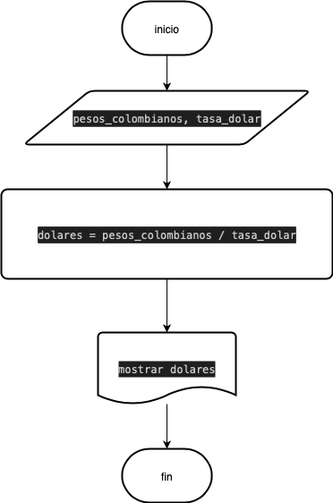

# ejercicio 2. 

Construye un algoritmo que, al recibir como datos el ID del empleado y los seis primeros sueldos del año, calcule el ingreso total semestral y el promedio mensual, e imprima el ID del empleado, el ingreso total y el promedio mensual.

## Psudocódigo 

```
inicio 
leer id, s1, s2, s3, s4, s5, s6
total = s1 + s2 + s3 + s4 + s5 + s6
promedio = total / 6 
mostrar id, total, promedio 
fin
```
## Diagrama de flujo


# Ejercicio 3 

Una empresa importadora desea determinar cuantos dolares puede adquirir con equis cantidad de dinero colombiano. Realice un diagrama de flujo y pseudocodigo que representen el algoritmo para tal fin. 

## Psudocódigo 

```

inicio
leer pesos_colombianos, tasa_dolar
dolares = pesos_colombianos / tasa_dolar
mostrar dolares
fin

```
## Diagrama de flujo

